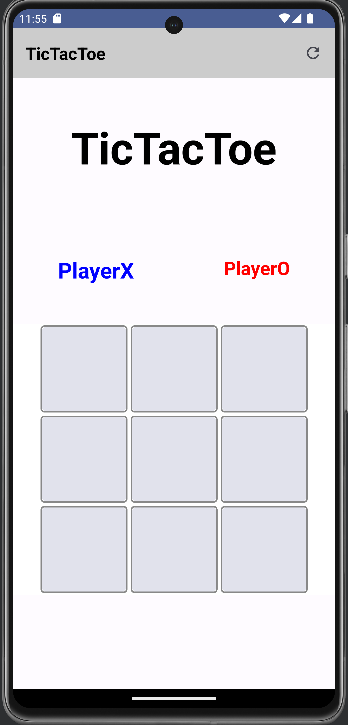
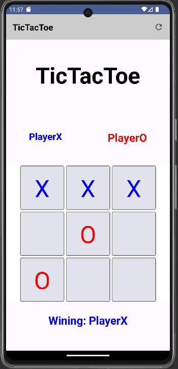

# TicTacToe

Der Leistungsnachweis besteht darin das Spiel TicTacToe fertig zu implementieren.
Insgesamt werden 10 Punkte vergeben.(Aufteilung siehe Funktionen)

### Spielregeln
https://en.wikipedia.org/wiki/Tic-tac-toe

Aufgabe:
Wir stellen ein Template des Spiels zur Verfügung bei dem die Klasse ViewModel nicht vorhanden ist.
Die Aufgabe ist es das ViewModel zu implementieren und einzubinden, sodass das Spiel funktioniert.

3 Funktionen müssen im ViewModel implementiert werden:

(3 Punkte)
```Kotlin
// Hier wird das Spielfeld und Gamemodel resettet
// In HomeScreen.kt TODO beachten
// In MainActivity.kt TODO beachten
fun resetGame()
{}
```
(4 Punkte)
```Kotlin
// Hier besteht die Aufgabe darin, die Aktiverung der Boxen zu implementieren.
// In HomeScreen.kt TODO beachten
fun selectField(field: Field)
{}
```

(3 Punkte)
```Kotlin
// Hier werden die Spalten, Reihen und Diagonalen überprüft und das Game beendet, falls ein Spieler gewonnen hat.
fun checkEndingGame()
{}
```



